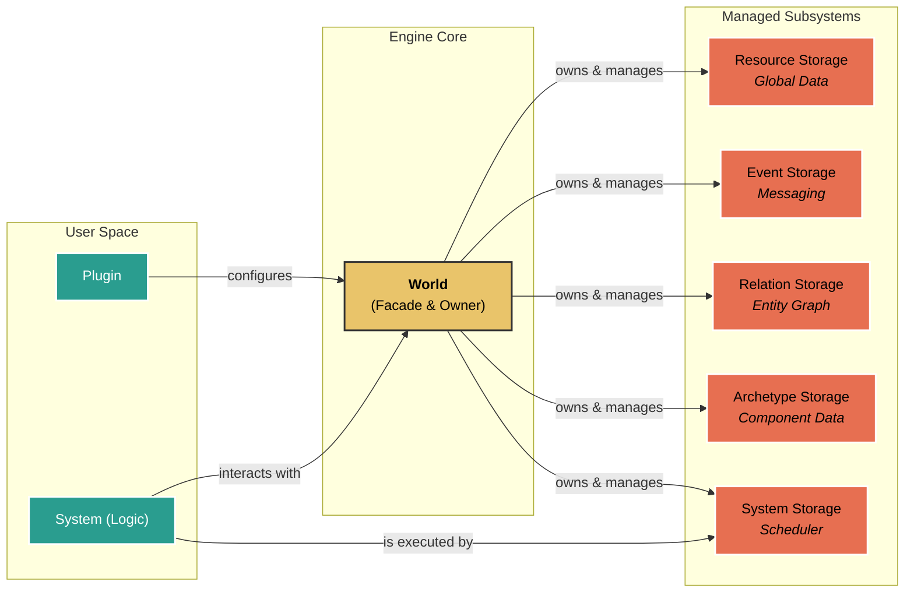

# Jade Engine


A C# .NET 9 game engine focused on performance, clean architecture, and the joy of learning.

## ✨ Project Philosophy

The Jade Engine is a learning project with the goal of deeply exploring the concepts that drive modern game engines.

* **Performance First**: Every architectural decision is made with performance in mind. This includes manual memory management, the use of SIMD intrinsics, and data structures optimized for the CPU cache.
* **Modular Architecture**: Inspired by Bevy, everything is a plugin. The core itself is minimal, and all features (rendering, input, etc.) can be added or replaced, offering maximum flexibility.
* **Deep Learning**: This project isn't meant to compete with industry giants, but to serve as a knowledge base and an experimental playground for the "how" and "why" of game engine engineering.

## 🚀 Quick Start

1. clone the repository

```bash
git clone https://github.com/AerafalGit/Jade.git
```

2. go to Jade folder
```bash
cd Jade
```

3. run an exemple project
```bash
dotnet run --project examples/YourExampleName
```

## Core Features

- ✅ Archetype-based ECS: Data storage in a Structure of Arrays (SoA) layout for ultra-fast queries.

- ✅ Plugin System: A fully modular architecture.

- ✅ System Scheduler: Manages dependencies ([RunAfter], [RunBefore]) with topological sorting and cycle detection.

- ✅ Entity Relations: A graph system to create complex links between entities, with indexing for high-performance queries.

- ✅ Asynchronous Messaging: A double-buffered event system for safe and predictable communication.

- ✅ Manual Memory Management: Uses aligned native memory for critical data, avoiding GC pressure.

## 🏛️ Architecture at a Glance

The World is the heart of the engine. It contains no game logic itself but acts as a central orchestrator that owns and coordinates all specialized subsystems.

For a more detailed analysis of the interactions, data structures, and design choices, please see the [ARCHITECTURE.md](ARCHITECTURE.md) file.



## 🗺️ Current Status

- ✅ ECS Core: Entities, components, archetypes, queries.

- ✅ Infrastructure: Plugins, system scheduling, resources.

- ✅ Advanced Systems: Relations and Events.

- 🚧 Rendering: WebGPU graphics pipeline integration.

- ✅ User Input: Keyboard, mouse, and gamepad handling.

- 🚧 Physics: Integration of a physics engine.

- 🚧 Assets: Asset loading and management system (models, textures...).

## 🤝 Contributing

This project is primarily a personal learning journey, but feedback, bug reports, and contributions are welcome. Feel free to open an Issue or a Pull Request!

## 📜 License
This project is distributed under the MIT License. See the [LICENSE](LICENSE) file for more details.
